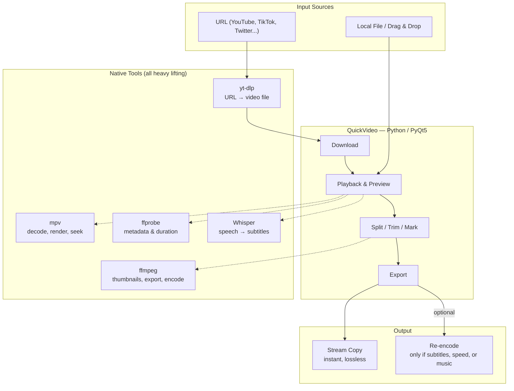

# QuickVideo

A fast, keyboard-driven video editor and splitter built with PyQt5 and mpv.

Split videos into segments, mark what to keep or cut, and export — all without re-encoding.

## How It Works



> Python is just the glue — playback, downloading, transcoding, and transcription are all handled by native C tools. QuickVideo orchestrates them with a keyboard-first UI.

## Install

Requires: Python 3, PyQt5, python-mpv, ffmpeg, ffprobe, yt-dlp (optional, for downloads)

```bash
# Symlink to PATH
sudo ln -sf ~/Desktop/quick_video/quick_video.py /usr/local/bin/quick-video
```

## Usage

```bash
quick-video                        # Launch empty
quick-video /path/to/video.mp4     # Open a video directly
quick-video --resume               # Reopen the last loaded video
```

You can also drag and drop a video file onto the window.

## Tabs

| Tab | Purpose |
|-----|---------|
| **Download URL** | Paste a URL (YouTube, TikTok, Twitter, etc.) and download via yt-dlp |
| **Open File** | Browse for a local video file. Shows up to 5 recent files for quick access |
| **Queue** | Queue multiple URLs for background downloading, independent of the editor |

## Keyboard Shortcuts

### Playback

| Key | Action |
|-----|--------|
| `Space` | Play / Pause |
| `Left` | Step back 1 second |
| `Right` | Step forward 1 second |
| `Shift+Left` | Step back 0.1 seconds |
| `Shift+Right` | Step forward 0.1 seconds |
| `Ctrl+Left` | Step back 10 seconds |
| `Ctrl+Right` | Step forward 10 seconds |
| `Home` | Jump to start |
| `End` | Jump to end |
| `J` | Decrease playback speed |
| `K` | Reset speed to 1x |
| `L` | Increase playback speed |

Speed steps: 0.25x → 0.5x → 1x → 1.5x → 2x → 3x → 4x

### Privacy

| Key | Action |
|-----|--------|
| `` ` `` | Toggle privacy mode — blacks out video, hides thumbnails. Audio and all editing still works. Persists across sessions. |

### Editing

| Key | Action |
|-----|--------|
| `S` | Split at current position |
| `Shift+S` | Split a one-second clip at current position and advance |
| `Q` | Mark the segment immediately before the playhead as cut |
| `W` | Mark the segment immediately after the playhead as cut |
| `X` / `Delete` | Toggle keep/cut on the selected segment |
| `I` | Set trim in-point (start) |
| `O` | Set trim out-point (end) |
| `Up` | Select previous segment |
| `]` / `Down` | Select next segment |

### Segment Speed

| Key | Action |
|-----|--------|
| `U` | Set selected segment to 1.25x speed |
| `Y` | Set selected segment to 1.5x speed |
| `;` | Set selected segment to 1.75x speed |
| `[` | Set selected segment to 2.0x speed |

### File Operations (work even in text fields)

| Key | Action |
|-----|--------|
| `Ctrl+S` | Quick Save |
| `Ctrl+L` | Quick Load (latest save) |
| `Ctrl+E` | Export |
| `Ctrl+O` | Open file |
| `Ctrl+Z` | Undo |
| `Ctrl+Shift+Z` | Redo |
| `Ctrl+T` | Generate subtitles (Whisper) |

## Mouse Controls

### Video Preview

| Action | Effect |
|--------|--------|
| Click left half | Seek back 15 seconds |
| Click right half | Seek forward 15 seconds |

### Timeline

| Action | Effect |
|--------|--------|
| Left click | Seek to position (snaps to nearby segment boundaries) |
| Left drag | Scrub through video |
| Ctrl + Scroll | Zoom in/out |
| Scroll (when zoomed) | Pan left/right |
| Right-click drag (when zoomed) | Pan left/right |
| Hover | Shows time label and snap indicators |

### Segments Panel

| Action | Effect |
|--------|--------|
| Left click | Toggle keep/cut on the segment |
| Right click | Select segment |

## Segments

Segments are displayed as compact widgets:
- **Blue** = KEEP (will be in the export)
- **Red** = CUT (will be excluded)

Click a segment to toggle between keep and cut.

## Quick Save / Load

- `Ctrl+S` saves your current edit state (segments, playhead position, file path) to `{save_dir}/.save_N`
- `Ctrl+L` loads the most recent save
- Each save creates a new numbered file, so you never lose previous saves

## Export

Press `Ctrl+E` to export. Only segments marked as KEEP are included.

- Single segment: direct stream copy (instant)
- Multiple segments: concatenated via ffmpeg concat demuxer
- No re-encoding — preserves original quality
- The save dialog opens in your configured export directory (see Settings)
- If you save without a file extension, `.mp4` is appended automatically
- If subtitles exist, you're prompted to burn them in (re-encodes with white text overlay) or export without
- After export, a **Delete Original** button appears next to Export for quick cleanup (with confirmation) — this also deletes the matching `.srt` file and clears the editor back to the empty state

## Download Queue

The Queue tab lets you queue multiple URLs for background downloading, independent of the editor.

- Add URLs one at a time — they download sequentially in the background
- The queue is **persisted to disk** — if you close and reopen the app, pending downloads resume automatically
- All download URLs are also saved to the link history for reference

## Music Layer

Load a separate background music track to mix with your video during export.

- Toggle the music layer with the purple music button below the timeline
- Browse for an audio file and adjust volume (0–100%)
- Music stays synced with the video during playback
- On export, music is mixed into the final video (requires audio re-encode)

## Compress

The Compress tab provides video compression with preset and custom options.

**Built-in presets:**

| Preset | CRF | Description |
|--------|-----|-------------|
| Near-Lossless | 17 | Archival quality |
| High Quality | 20 | Noticeable size reduction |
| Balanced | 24 | Good quality, good compression |
| Compact | 28 | Smaller file at full resolution |
| Small File | 32 | Maximum compression, 720p downscale |

**Custom settings:** CRF slider (15–40), x264 preset, audio bitrate (64k–256k), resolution scaling (original/1080p/720p/480p).

**Preview workflow:** Extracts a 5-second snippet, tests compression on it, then shows original vs compressed size so you can compare before committing to a full compress.

## Subtitles

- On load, if a `.srt` file exists next to the video it's loaded automatically; otherwise Whisper generates one (`Ctrl+T` to regenerate)
- Subtitles appear in the right panel — click any line to jump to that timestamp (continues playing if video was playing)
- The current subtitle is highlighted during playback
- After clicking a subtitle, keyboard shortcuts (e.g. `S` to split) work immediately
- On export, you can choose to burn subtitles into the video (re-encodes) or skip them

## Kept Duration

When you have more than one segment, a green duration label appears in the center of the playback bar showing the total kept time of all segments except the last. Displayed as e.g. `2m 34s` or `1h 5m 12s`. Hidden when there's only one segment.

## Configuration

All paths are configurable via the **Settings** panel (gear button in the top-right corner of the tab bar) or by editing `settings.ini` directly. Changes made in the panel are saved to `settings.ini` immediately.

To start from scratch, copy the example:

```bash
cp settings.example.ini settings.ini
```

`settings.ini` is gitignored — only `settings.example.ini` is committed.

```ini
[paths]
download_dir = ~/Videos              # Downloaded videos
cache_dir = ~/.quick_video           # Thumbnails, link history, queue, last-video state
waveform_dir = ~/.quick_video/audio  # Waveform caches
save_dir = ~/Videos                  # Quick save files (.save_0, .save_1, ...)
export_dir = ~/Videos                # Default directory for the export save dialog
recents_file = ~/.quick_video/.recents.txt  # Recent files list

[downloads]
# aux_download_dir = /some/other/path  # Override download_dir if set
```

The Open File dialog also defaults to `download_dir`.

### Cached data locations

| What | Location |
|------|----------|
| Thumbnails | `{cache_dir}/{hash}/thumb_NNNN.png` |
| Waveforms | `{waveform_dir}/{hash}.json` |
| Last video (`--resume`) | `{cache_dir}/last_video.txt` |
| Link history | `{cache_dir}/.cache/link_list.txt` |
| Download queue | `{cache_dir}/.cache/queue.txt` |
| Recent files | `{recents_file}` |
| Quick saves | `{save_dir}/.save_0`, `.save_1`, ... |

Thumbnail and waveform caches are keyed by SHA-256 hash of file path + size + mtime — they auto-invalidate if the file changes.
